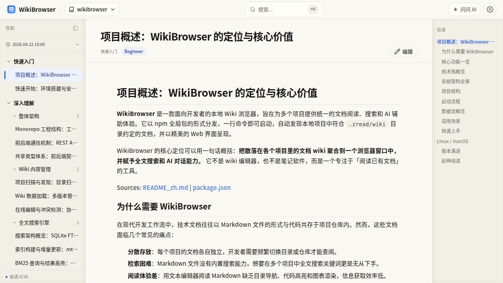

# WikiBrowser

[](https://www.npmjs.com/package/@dayinxisheng/wikibrowser)
[](https://www.npmjs.com/package/@dayinxisheng/wikibrowser)

本地 Wiki 文档浏览器 —— 集中管理和浏览散落在多个项目中的技术文档。

## 架构概览


## 功能亮点

- **多项目管理** — 自动扫描磁盘上的项目，发现并加载 `.zread/wiki` 目录下的文档
- **全文搜索** — SQLite FTS5 + jieba 中文分词 + BM25 排序，`Ctrl+K` 即搜
- **AI 辅助** — 集成 Kimi CLI，支持流式对话、上下文引用、工具审批
- **富文档渲染** — Markdown + Shiki 代码高亮（双主题）+ Mermaid 交互式图表
- **Wiki 编辑** — 就地编辑文档，冲突检测和变更标注



## 快速开始

### 环境要求

- Node.js >= 18 <= 22（推荐 20 LTS）
- npm >= 9

> **注意**：由于依赖 `better-sqlite3`（原生 C++ 模块），目前不支持 Node.js 23+。推荐使用 Node.js 20 LTS 以获得最佳兼容性。

### 安装

```bash
npm install -g @dayinxisheng/wikibrowser
```

### 启动

```bash
# 本地访问（无需认证）
wikibrowser

# 局域网访问（自动生成认证密码）
wikibrowser --host 0.0.0.0

# 自定义端口
wikibrowser --port 8080

# 自定义认证密码
wikibrowser --host 0.0.0.0 --auth-code mypassword
```

启动后控制台会显示访问地址和认证密码（如有）。

## CLI 参数

| 参数 | 说明 | 默认值 |
|------|------|--------|
| `--host` | 绑定主机地址 | `127.0.0.1` |
| `--port` | 服务端口 | `9001` |
| `--auth-code` | 自定义认证密码 | 局域网自动生成 |
| `--no-auth` | 禁用认证 | - |
| `--log-level` | 日志级别（debug/info/warn/error） | `info` |
| `-v, --version` | 显示版本号 | - |
| `-h, --help` | 显示帮助信息 | - |

## 使用指南

| 指南 | 说明 |
|------|------|
| [快速上手](docs/user-guide/getting-started.md) | 安装启动、界面概览、基本操作流程 |
| [Wiki 生成](docs/user-guide/wiki-generation.md) | 用 AI Skill 为你的项目生成 Wiki 文档 |
| [AI 对话](docs/user-guide/ai-chat.md) | AI 辅助对话、上下文引用、工具审批 |
| [搜索与编辑](docs/user-guide/search-and-editing.md) | 全文搜索、文档编辑、快捷键 |

## 技术栈

TypeScript · React · Express · SQLite · Shiki · Mermaid · Zustand · Vite

## 开发

```bash
npm install            # 安装依赖
npm run dev            # 开发模式（前后端同时启动）
npm test               # 运行测试
npm run build          # 构建生产版本
npm run build:e2e && npm run test:e2e  # E2E 测试
```

## 相关项目

[zread-cli](https://github.com/ZreadAI/zread_cli) 生成wiki也可以使用这个工具，本项目也有参考其输出格式


## License

[CC BY-NC-SA 4.0](./LICENSE)
