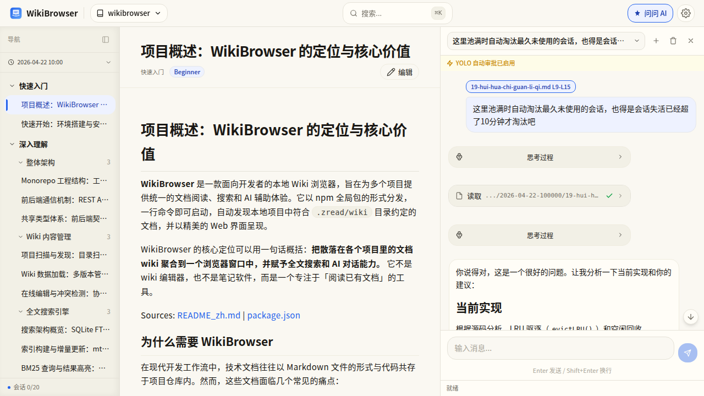
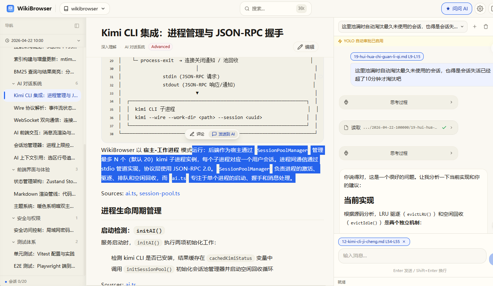
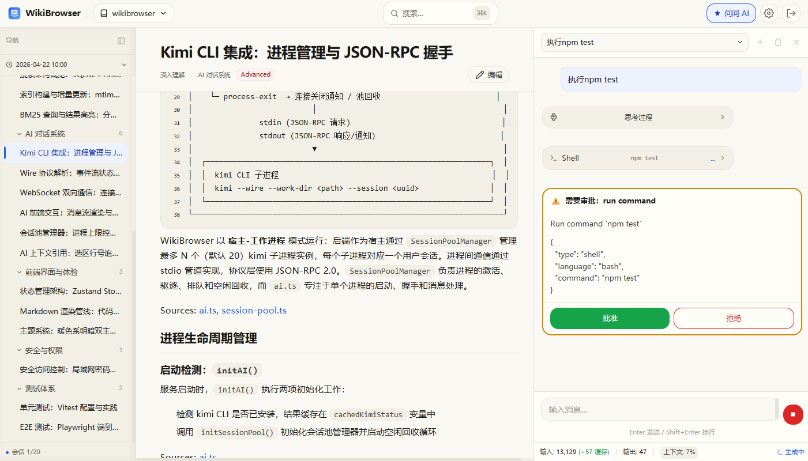
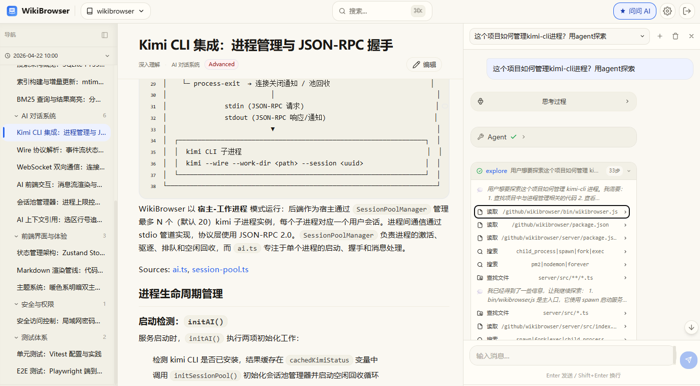

# AI 对话功能

## 概述

WikiBrowser 集成了 AI 对话能力，可以在浏览文档的同时与 AI 讨论代码、架构和文档内容。

AI 功能基于 [Kimi CLI](https://moonshotai.github.io/kimi-cli/)，需要本地安装 kimi 命令行工具。

### 安装 Kimi CLI

```bash
# Linux / macOS
curl -LsSf https://code.kimi.com/install.sh | bash

# 或者使用 uv
uv tool install --python 3.13 kimi-cli
```

## 启用 AI 面板

点击界面右上角的 **AI 按钮**，右侧会展开 AI 对话面板。首次使用会自动创建 AI 会话。

<!-- 截图：AI 面板展开后的界面，展示对话输入框和消息区域 -->
<!-- 图片文件：images/screenshot-ai-panel.png -->

## 基本对话

在输入框中输入问题，AI 会以流式方式实时返回回答。

支持的对话类型：

- **代码分析** — "这个函数的作用是什么？"
- **架构讨论** — "这个项目的模块间是怎么通信的？"
- **文档理解** — "解释一下这篇文档中提到的设计模式"
- **Bug 排查** — "这个错误可能是什么原因导致的？"



> AI 可以访问当前项目的源代码文件，回答时能够引用具体的代码位置。

## 上下文引用

上下文引用是 AI 对话的核心功能，让你把文档中的关键内容发送给 AI 作为参考。

### 使用方式

1. 在文档中 **选中一段文字**
2. 点击出现的 **"发送给 AI"** 按钮
3. AI 会基于选中的内容进行回答

引用信息会自动携带：

- 文件路径
- 行号范围
- 所在项目名称
- 选中的文本内容




### 适用场景

- 选中一段架构描述，让 AI 解释对应的代码实现
- 选中一段 API 文档，让 AI 补充使用示例
- 选中一段报错信息，让 AI 分析可能的原因

## 工具审批

AI 在回答过程中可能会调用工具（如读取文件、搜索代码）。每次工具调用会弹出审批请求：

- **批准** — 允许 AI 执行该操作
- **拒绝** — 阻止 AI 执行


### YOLO 模式

如果你信任当前项目环境，可以开启 **YOLO 模式**，自动批准所有工具调用，无需逐个确认。

开启方式：在设置面板中勾选 "YOLO 模式"。

> ⚠️ YOLO 模式会自动批准所有操作（包括文件读取、命令执行等），请确保你信任当前项目环境。

## 子代理嵌套

AI 在处理复杂任务时可能会创建子代理并行工作。对话面板中会以缩进方式展示子代理的活动：

- 主代理的对话内容正常显示
- 子代理的操作以缩进折叠展示
- 可以展开查看子代理的详细执行过程



## 对话搜索

在 AI 面板中按 `Ctrl+F`（Mac: `Cmd+F`）可以搜索历史消息，匹配结果会高亮显示。

## 会话管理

- 每个项目的 AI 会话独立管理
- 支持查看历史会话列表
- 可以删除不需要的会话
- 会话池自动管理进程资源（空闲回收、LRU 驱逐）

## 配置

| 配项 | 说明 | 默认值 |
|------|------|--------|
| `aiPromptTimeout` | AI prompt 超时时间（分钟） | 10 |
| `yolo` | 自动批准模式（YOLO 模式） | 关闭 |

配置文件位置：

| 平台 | 路径 |
|------|------|
| Windows | `%USERPROFILE%\.wikibrowser\settings.json` |
| Linux/macOS | `~/.wikibrowser/settings.json` |

也可以通过 WikiBrowser 的设置界面直接修改。

## 常见问题

**Q: AI 面板没有反应？**

确保已安装 Kimi CLI 并且 `kimi` 命令在 PATH 中。可以在终端运行 `kimi --version` 验证。

**Q: 工具调用一直等待审批？**

在弹出的审批请求中点击"批准"。如果不想逐个确认，开启 YOLO 模式。

**Q: AI 回答中断？**

可能是超时，检查 `aiPromptTimeout` 配置或网络连接。也可以尝试重新发送问题。

**Q: AI 提示 Token 使用率过高？**

上下文窗口接近上限时会发出警告。建议精简对话历史或开启新的会话。
