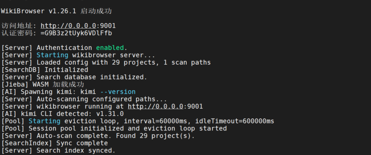
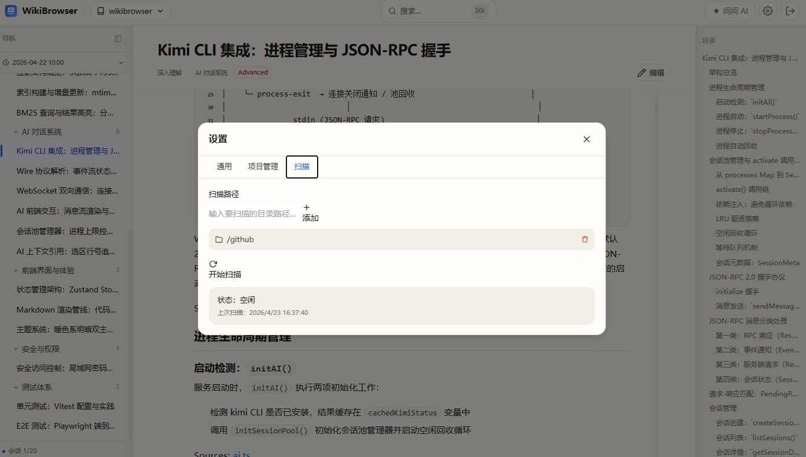

# 快速上手

## 安装

### 环境要求

- Node.js >= 18 <= 22（推荐 20 LTS）
- npm >= 9

> **注意**：由于依赖 `better-sqlite3`（原生 C++ 模块），目前不支持 Node.js 23+。Node.js 23 及以上版本没有可用的预编译二进制文件。推荐使用 Node.js 20 LTS 以获得最佳兼容性。

### 全局安装

```bash
npm install -g @dayinxisheng/wikibrowser
```

安装完成后，`wikibrowser` 命令即可在终端使用。

## 启动

```bash
# 本地访问（无需认证）
wikibrowser
```

启动后在浏览器打开 http://127.0.0.1:9001 即可使用。

> 如果端口被占用，用 `--port` 指定其他端口：
> ```bash
> wikibrowser --port 8080
> ```




## 项目扫描原理

WikiBrowser 启动后会扫描磁盘上的项目目录，自动发现包含 `.zread/wiki/` 的项目。

扫描范围可在 **设置面板** 中配置：

- 添加多个扫描路径
- 设置扫描深度
- 排除特定目录
- 手动添加项目路径



> 如何让你的项目被扫描到？参考 [Wiki 生成指南](wiki-generation.md) 了解如何为项目生成 Wiki 文档。

## 界面概览

WikiBrowser 界面由四个区域组成：


### 1. 侧边栏（左侧）

- **项目列表**：所有已扫描到的项目，点击切换项目
- **版本选择**：切换 Wiki 版本（如果有多个版本）
- **目录导航**：当前文档的章节目录，点击跳转

### 2. 内容区（中间）

- Markdown 渲染显示
- 代码块语法高亮（支持 100+ 语言）
- Mermaid 图表交互式渲染
- 目录自动跟随滚动高亮

### 3. 搜索（全局弹窗）

- 按 `Ctrl+K`（Mac: `Cmd+K`）呼出
- 支持中英文混合搜索
- BM25 相关度排序

### 4. AI 面板（右侧，可折叠）

- 与 AI 对话讨论代码和文档
- 选中文本发送作为上下文
- 支持流式输出和工具审批

## 基本操作流程

1. **安装** → `npm install -g @dayinxisheng/wikibrowser`
2. **启动** → `wikibrowser`
3. **浏览** → 在侧边栏选择项目 → 点击文档标题阅读
4. **搜索** → `Ctrl+K` 输入关键词
5. **编辑** → 点击编辑按钮修改文档 → `Ctrl+S` 保存
6. **AI 问答** → 打开 AI 面板 → 输入问题

## 认证说明

| 场景 | 行为 |
|------|------|
| 本地访问（127.0.0.1） | 默认无需密码 |
| 局域网访问（0.0.0.0） | 自动生成 18 位密码，在终端输出 |
| 自定义密码 | `--auth-code <密码>` 指定 |
| 关闭认证 | `--no-auth` 参数 |

安全特性：
- 暴力破解防护（5 次失败锁定 5 分钟）
- 登录后发放 Token，后续请求自动携带


## 常见问题

**Q: 扫描不到我的项目？**

检查项目目录下是否有 `.zread/wiki/` 目录。没有的话需要先用 AI 工具生成 Wiki 文档，参考 [Wiki 生成指南](wiki-generation.md)。

**Q: 启动报端口占用？**

用 `--port` 指定其他端口：`wikibrowser --port 8080`

**Q: Windows 上安装失败？**

`better-sqlite3` 需要编译原生模块。确保已安装 Visual Studio Build Tools：
```powershell
npm install -g windows-build-tools
```

**Q: 如何更新到最新版本？**

```bash
npm update -g @dayinxisheng/wikibrowser
```
