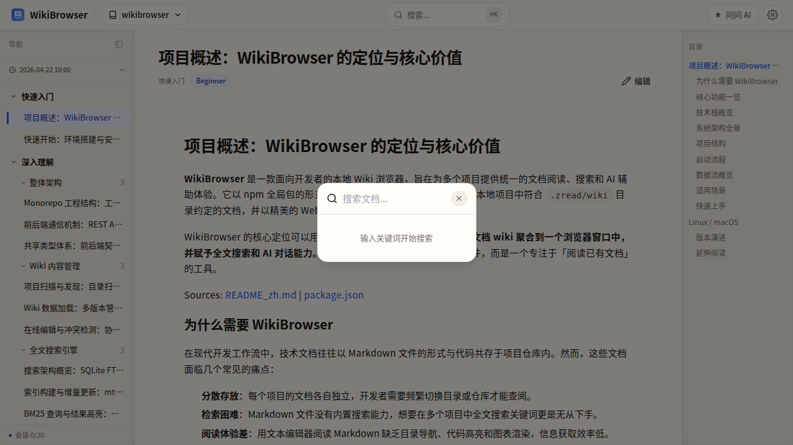
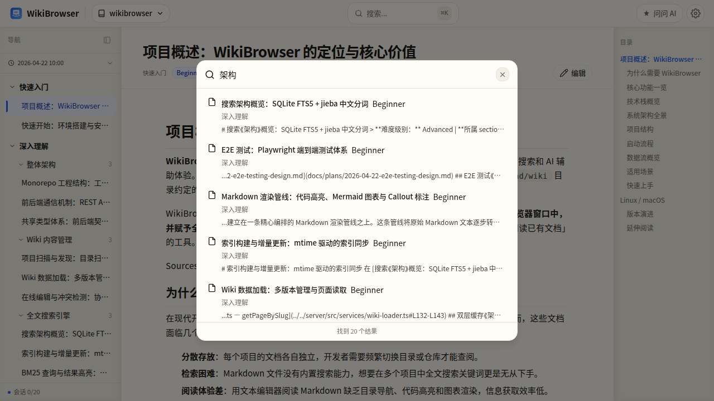
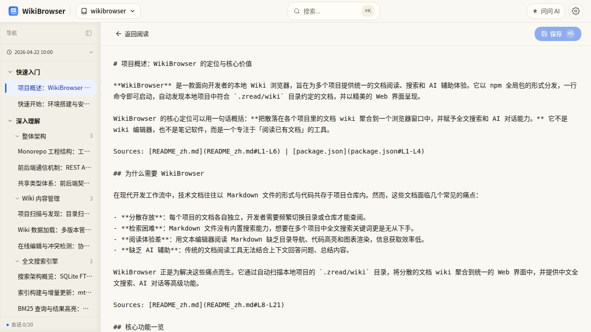
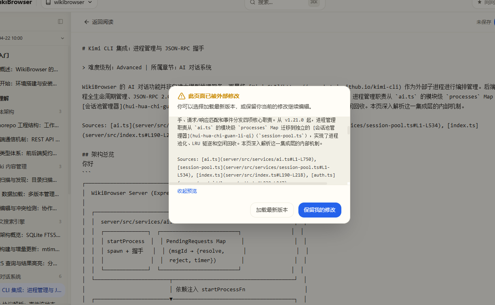
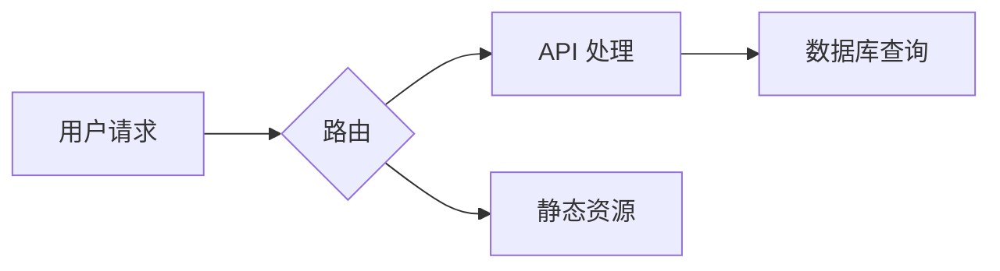

# 搜索与编辑

## 全文搜索

### 打开搜索

按 `Ctrl+K`（Mac: `Cmd+K`）打开全局搜索弹窗。



### 搜索特性

- **中文分词** — 基于 jieba 分词，支持中文自然语言搜索
- **中英混搜** — 可以同时搜索中英文关键词
- **BM25 排序** — 结果按相关度排序，最相关的排最前面
- **实时搜索** — 输入即搜索，200ms 防抖
- **内容摘要** — 结果中展示匹配片段，关键词高亮

### 搜索范围

搜索覆盖所有已扫描项目的：

- 文档标题
- 章节名称
- 文档正文内容

### 搜索技巧

- 输入关键词即可，无需特殊语法
- 多个关键词用空格分隔（AND 逻辑）
- 支持按项目筛选搜索结果
- 搜索结果支持分页浏览



## 文档编辑

### 进入编辑模式

在文档页面点击 **编辑按钮**（右上角工具栏），进入 Markdown 编辑模式。



### 编辑操作

| 操作 | 快捷键 |
|------|--------|
| 保存 | `Ctrl+S` / `Cmd+S` |
| 退出编辑 | `Esc` |

编辑过程中：

- 未保存的修改会在标题栏显示脏状态标记
- Markdown 源码直接编辑，保存后自动重新渲染
- 保存后 WikiBrowser 会更新搜索索引

### 冲突检测

如果在你编辑期间文件被外部修改（如 git pull、其他工具），保存时自动检测冲突：

1. 检测到文件已被外部修改
2. 弹出冲突对话框，展示两个版本的差异
3. 你可以选择：
   - **保留服务端版本** — 放弃你的修改
   - **保留我的修改** — 覆盖服务端版本




## 快捷键

| 快捷键 | 功能 |
|--------|------|
| `Ctrl+K` / `Cmd+K` | 打开搜索 |
| `Ctrl+B` / `Cmd+B` | 切换侧边栏 |
| `Ctrl+S` / `Cmd+S` | 保存文档（编辑模式下） |
| `Ctrl+F` / `Cmd+F` | 搜索 AI 消息（AI 面板打开时） |
| `Esc` | 关闭弹窗 / 退出编辑 |

## 主题切换

支持 **亮色** 和 **暗色** 两种主题，点击界面右上角的主题切换按钮即可切换。

- 主题偏好自动保存到本地
- 代码高亮和 Mermaid 图表跟随主题变化

## 目录导航

文档右侧自动生成目录（TOC），基于 Markdown 标题层级：

- 点击目录项跳转到对应章节
- 当前阅读位置会在目录中高亮
- 支持多级标题（H1-H4）

## Mermaid 图表

文档中的 Mermaid 代码块会自动渲染为交互式图表：

- 支持流程图、时序图、类图、甘特图等
- 点击图表可全屏查看
- 颜色自动跟随当前主题（亮色/暗色）



## 代码块

文档中的代码块具有以下特性：

- **语法高亮** — 支持 100+ 编程语言，基于 Shiki
- **双主题** — 亮色（one-light）/ 暗色（one-dark-pro），跟随系统主题
- **复制按钮** — 一键复制代码内容

```typescript
// 示例：TypeScript 代码块自动高亮
interface WikiPage {
  slug: string;
  title: string;
  content: string;
}
```

## 项目缓存刷新

如果文档内容在外部有更新（如 AI 重新生成了 wiki），可以在项目列表中点击 **刷新按钮** 来重新加载：

- 重新读取 `.zread/wiki/` 目录
- 更新搜索索引
- 刷新页面内容
