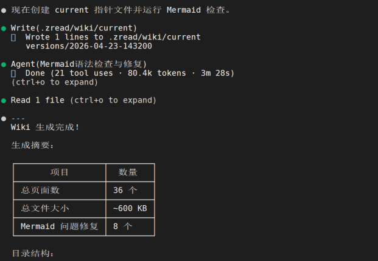

# Wiki 生成指南

## 什么是 zread-wiki？

`zread-wiki` 是一个 AI Skill，用于自动分析代码库并生成结构化的 Wiki 文档。它可以运行在 Claude Code、Kimi-CLI、Codex 等 AI 编程助手中。

生成的文档保存在项目的 `.zread/wiki/` 目录下，WikiBrowser 会自动扫描并加载这些文档。

## 生成的目录结构

在你的项目根目录下生成如下结构：

```
你的项目/
└── .zread/
    └── wiki/
        ├── current                          # 当前版本指针
        └── versions/
            ├── 2026-04-20-100000/           # 第一次生成
            │   ├── wiki.json                # 文档索引
            │   └── pages/
            │       ├── 01-项目概述.md
            │       ├── 02-快速开始.md
            │       ├── 03-架构概览.md
            │       └── ...
            └── 2026-04-23-140000/           # 增量更新后
                ├── wiki.json
                └── pages/
                    ├── 01-项目概述.md        # 保留
                    ├── 02-快速开始.md        # 保留
                    ├── 03-架构概览.md        # 已更新
                    └── 04-新增功能.md        # 新增
```

- `current` 文件指向当前使用的版本目录
- 每次生成/更新都会创建一个带时间戳的新版本
- WikiBrowser 中可切换历史版本浏览

## 在 Claude Code 中使用

### 首次生成

在项目根目录下启动 Claude Code，输入：

```
生成 wiki
```

或者更明确地：

```
/zread-wiki
```

Claude Code 会自动调用 `zread-wiki` skill，执行以下流程：

1. **分析项目** — 扫描代码结构、识别模块和依赖关系
2. **生成目录** — 展示文档目录结构，让你确认或调整
3. **并行生成** — 按确认的目录并行生成各页面内容
4. **Mermaid 检查** — 自动检查并修复图表语法



> 首次生成时会询问并发数（默认 2，建议 1-5），并发数越高生成越快，但消耗的 Token 越多。

### 增量更新

当项目代码有变更时，再次触发即可增量更新：

```
更新 wiki
```

增量更新会：

1. 检测上次生成以来的代码变更（基于 git diff）
2. 只更新受影响的页面
3. 为新增文件创建新页面
4. 保留未变更的页面

你会看到类似这样的变更计划：

```
📝 需更新（2页）：
  - 05-认证模块.md（src/auth/login.ts 变更）
  - 08-API设计.md（src/api/routes.ts 变更）
✅ 保留（6页）：01-项目概述.md, 02-快速开始.md, ...
⚠️ 未覆盖文件（2个）：
  - src/payment/stripe.ts（新增）
  - src/payment/models.ts（新增）
```

确认后开始增量更新。

## 在 Kimi-CLI 中使用

启动 Kimi CLI，在项目目录下输入：

```
帮我生成项目 wiki 文档
```

Kimi-CLI 会读取 `zread-wiki` skill 定义，执行相同的生成流程。

更新时：

```
更新 wiki
```

## 在 Codex 中使用

```bash
codex "使用 zread-wiki skill 为这个项目生成 wiki 文档"
```

更新时：

```bash
codex "更新项目 wiki"
```

## wiki.json 索引格式

每个版本目录下都有一个 `wiki.json`，记录文档的元信息：

```json
{
  "id": "your-project",
  "name": "你的项目名称",
  "generated_at": "2026-04-23T14:00:00Z",
  "language": "zh",
  "pages": [
    {
      "slug": "architecture",
      "title": "架构概览",
      "file": "03-架构概览.md",
      "section": "深入理解",
      "level": "Intermediate",
      "sources": ["src/server.ts", "src/routes/"]
    }
  ]
}
```

- `sources` 字段记录了页面引用的源文件，增量更新时用于判断哪些页面需要刷新
- `section` 用于在侧边栏中分组展示
- `level` 标记文档难度（Beginner / Intermediate / Advanced）

## 文档页面规范

生成的每个页面是一个 Markdown 文件，具备以下特性：

- 标准 Markdown 语法 + GFM 扩展（表格、任务列表等）
- Mermaid 图表（流程图、时序图、类图等）
- 代码块带语言标注（WikiBrowser 自动高亮）
- 源码引用标注（每段内容标注参考了哪些源文件）

## 最佳实践

### 1. 首次生成

在项目根目录执行，确保 AI 工具有完整的代码上下文。项目规模决定生成页面数量：

| 规模 | 条件 | 页面数量 |
|------|------|----------|
| 小型 | < 50 源文件 | 8-10 页 |
| 中型 | 50-200 源文件 | 12-18 页 |
| 大型 | > 200 源文件 | 20-30 页 |

### 2. .gitignore 配置

建议将 `.zread/` 加入 `.gitignore`：

```gitignore
# AI 生成的 wiki 文档
.zread/
```

文档由 AI 生成，无需入库，随时可以重新生成。

### 3. 定期更新

建议在以下时机重新生成或增量更新：

- 大版本发布后
- 重要功能模块重构后
- 团队新人入职需要了解项目时

### 4. 手动微调

生成后可在 WikiBrowser 中在线编辑特定页面（参考 [搜索与编辑](search-and-editing.md)），手动补充生成不够完善的部分。注意：下次增量更新可能会覆盖手动修改的内容。

## 故障排除

**Q: AI 工具没有触发 zread-wiki skill？**

确保 `zread-wiki` skill 已正确安装。skill 的触发词包括：
- "生成 wiki"
- "生成项目文档"
- "更新 wiki"
- "给项目写 wiki"

**Q: 生成的文档质量不好？**

可以在触发时附加说明，引导 AI 关注特定方面：

```
生成 wiki，重点关注 API 设计和架构文档
```

```
生成 wiki，我需要详细的部署和运维指南
```

**Q: 增量更新后某些页面被覆盖了？**

增量更新只更新与代码变更相关的页面。如果手动编辑了未被更新的页面，那些页面会被保留。

