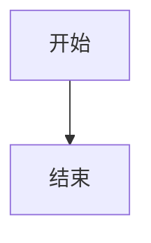
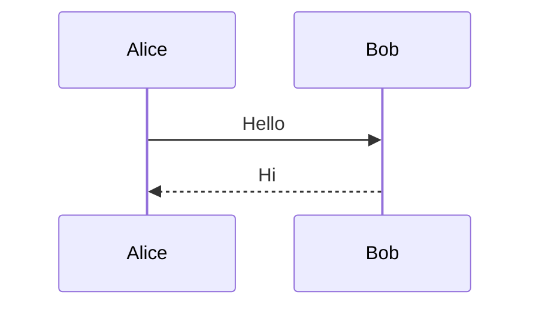

# Mermaid 语法检查与修复

本 skill 使用 `check-mermaid` 工具扫描 Markdown 文件中的 Mermaid 代码块，检测语法错误并自动修复。

## 工作流程

### 1. 获取扫描路径

首先询问用户要扫描的目录或文件路径：
- 可以是单个 Markdown 文件
- 可以是包含多个 Markdown 文件的目录

### 2. 执行检查

**Windows 环境下必须使用 PowerShell 格式执行命令：**

```powershell
powershell -Command "check-mermaid '<扫描路径>'"
```

示例：
```powershell
powershell -Command "check-mermaid 'D:\typescript_project\check-mermaid\.zread'"
```

可选：将报告输出到文件
```powershell
powershell -Command "check-mermaid '<扫描路径>' -o mermaid-report.md"
```

**Linux/macOS 环境：**

```bash
check-mermaid <扫描路径>
```

可选：将报告输出到文件
```bash
check-mermaid <扫描路径> -o mermaid-report.md
```

### 3. 分析错误

工具会输出类似以下格式的错误信息：

```
File: docs/example.md
  Lines: 10-15
  Error: Parse error on line 3:
  expecting 'SEMI', got '}'
```

### 4. 修复 Mermaid 代码

对于每个检测到的错误：

1. **读取目标文件**：使用 Read 工具读取包含错误的文件
2. **定位错误代码块**：根据行号定位 mermaid 代码块
3. **分析错误原因**：常见错误包括：
   - 语法结构错误（缺少括号、分号等）
   - 关键字拼写错误
   - 缩进或格式问题
   - 不支持的语法
4. **执行修复**：使用 Edit 工具修复代码，遵循以下原则：
   - **保持原有含义**：不改变图表表达的内容和逻辑
   - **最小改动原则**：只修改必要的语法部分
   - **保持风格一致**：尽量保持原有的代码风格

### 5. 重新验证

修复后重新执行检查命令，确保错误已修复。如果仍有错误，继续修复直到全部通过。

## 常见 Mermaid 错误修复示例

### 流程图错误

**错误代码：**
```mermaid
graph TD
    A[开始] --> B[结束
```

**修复后：**


### 序列图错误

**错误代码：**


**修复后：**


## 输出报告

修复完成后，向用户汇报：

1. 扫描的文件数量
2. 发现的错误数量
3. 修复的错误列表
4. 最终检查结果（通过/未通过）

## 注意事项

- 确保 Node.js 环境已安装
- 需要先全局安装：`npm install -g @dayinxisheng/check-mermaid`
- 对于复杂的 mermaid 错误，可能需要多次迭代修复
- 始终保持图表的原有语义和表达意图
